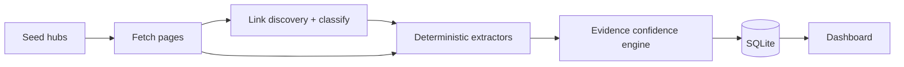

# Scholarship Intelligence Crawler

**Edxso AI Engineer Intern — Assignment 2**

Working system that keeps a scholarship repository continuously updated:

**Discover → Crawl → Extract → Verify → Score → Store → Update**

Built for Atlas Funding–style education funding intelligence: **authentic official sources**, **evidence-traced fields**, **deterministic confidence scores** (not LLM-invented), **change detection**, inspectable **SQLite**, and a **dashboard**.

Assignment brief: [Google Doc](https://docs.google.com/document/d/1xlrNNthicUCE9J8xh76EpmW_DMfgroKf/edit)

## Quick start

```bash
python -m venv .venv
.\.venv\Scripts\activate          # Windows
pip install -r requirements.txt
$env:PYTHONPATH = "src"           # PowerShell

# Fresh crawl
python -m scholarship_intel.cli crawl --max-pages 22

# Or reproduce demo artifacts (changes + stale)
python scripts/finalize_demo.py

# Dashboard
python -m scholarship_intel.cli serve
# http://127.0.0.1:8765
```

Sample DB (from a real crawl): `data/scholarships.sample.db`  
Copy to `data/scholarships.db` to browse without re-crawling:

```bash
copy data\scholarships.sample.db data\scholarships.db
python -m scholarship_intel.cli serve
```

## Minimum requirements checklist

| Requirement | Status (sample run) |
|---|---|
| 20+ real scholarships | **36** |
| 15+ verified vs official sources | **31 VERIFIED** |
| 10+ confidence ≥95% | **31** |
| ≥3 source types | government_portal, government, university |
| ≥2 change detection examples | **yes** (`data/sample_changes.json`) |
| ≥2 expired/stale examples | EXPIRED + NO_LONGER_VERIFIABLE |
| Free tools only | Python / BS4 / SQLite / FastAPI |
| No fabricated fields | Missing → `Not specified` |

## Architecture



Confidence is a **weighted evidence checklist** — see `src/scholarship_intel/verify/engine.py`.  
Technical write-up (≤3 pages): [docs/TECHNICAL_NOTE.md](docs/TECHNICAL_NOTE.md)

## Demo flow (for submission video)

1. `python -m scholarship_intel.cli crawl` — crawler starts, discovers NSP schemes  
2. Open dashboard — list + metrics  
3. Open one scholarship — official URL, evidence snippets, confidence breakdown  
4. `python scripts/finalize_demo.py` — second run detects deadline changes  
5. Refresh detail page — **CHANGE DETECTED** history + stale statuses  

## CLI

```bash
python -m scholarship_intel.cli crawl
python -m scholarship_intel.cli stats
python -m scholarship_intel.cli demo-changes
python -m scholarship_intel.cli serve --port 8765
```

## Repo layout

```
config/seeds.yaml          # discovery seeds + official domain allowlist
src/scholarship_intel/     # crawler, verify, store, web
templates/ + static/       # dashboard UI
data/scholarships.sample.db
data/sample_scholarships.json
data/sample_changes.json
docs/TECHNICAL_NOTE.md
scripts/finalize_demo.py
```

## License

MIT — educational assignment submission.
