# EDXSO Assignment 2 — Scholarship Intelligence Crawler

Production-minded Python system that keeps an education-funding repository continuously updated:

**Discover → Crawl → Extract → Verify → Score → Store → Update**

Built for [Atlas Funding](https://docs.google.com/document/d/1xlrNNthicUCE9J8xh76EpmW_DMfgroKf/edit)-style scholarship intelligence for Indian students.

**Never invents scholarship facts.** Missing fields are stored as `Not specified` and every important filled field keeps a source evidence snippet.

## Verification engine (internship focus)

This is not “ask an LLM for a confidence %”. Every scholarship goes through an **evidence-weighted verification stack**:

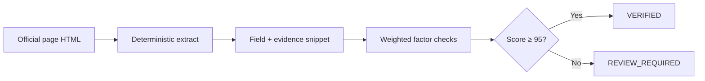

### What the verification layer does

1. **Official-source gate** — primary URL must match allowlisted domains (`.gov.in`, `.ac.in`, known portals)  
2. **Presence check** — name extracted from a successfully fetched official page  
3. **Evidence checks** — eligibility / deadline / amount only score when a snippet exists  
4. **Anti-aggregator** — blogs / Buddy4Study-style domains cannot be primary  
5. **Transparent breakdown** — dashboard shows factor points + “Why this score?”  
6. **CLI**

```bash
python -m scholarship_intel.cli crawl          # live crawl into SQLite
python scripts/finalize_demo.py               # re-crawl + change/stale demos
python -m scholarship_intel.cli serve         # dashboard
```

### Live verification sample metrics

From [`data/sample_scholarships.json`](data/sample_scholarships.json) + [`data/scholarships.sample.db`](data/scholarships.sample.db):

| Metric | Value |
|--------|-------|
| Scholarships discovered | **41** |
| VERIFIED (≥95%) | **32 / 41** |
| REVIEW_REQUIRED | **9** |
| With evidenced amount | **8** |
| With evidenced income | **4** |
| Avg confidence | **93.8%** |
| Change events | **2+** |
| Source types | government_portal · government · university · corporate_csr · ngo_trust |

Example VERIFIED schemes from the real crawl:

- *Reliance Foundation Undergraduate Scholarships* — **100%** (official FAQ PDF: amount, income, deadline)
- *National Scholarship For Post Graduate Studies* (NSP + UGC cross-enrich) — **100%**
- *Lady Meherbai D Tata Education Trust* — **97%** (official PDF)
- *AICTE — Pragati Scholarship Scheme For Girl Students* — **96%**

**Live demo (static):** https://edxso-scholarship-crawler.vercel.app  
**Live dashboard (FastAPI):** https://edxso-scholarship-crawler.onrender.com  
**Repo:** https://github.com/nishant-uxs/edxso-scholarship-crawler

## Submission pack (Assignment §14)

| Requirement | Link / location |
|-------------|-----------------|
| Live demo | https://edxso-scholarship-crawler.vercel.app |
| Live dashboard | https://edxso-scholarship-crawler.onrender.com |
| GitHub repository | https://github.com/nishant-uxs/edxso-scholarship-crawler |
| README / documentation | This file + [Architecture](#architecture) |
| Working demo / screenshots | [docs/screenshots/](docs/screenshots/) · [docs/demo/](docs/demo/) |
| Technical note (≤3 pages) | [docs/TECHNICAL_NOTE.md](docs/TECHNICAL_NOTE.md) |
| Working database / schema | [data/scholarships.sample.db](data/scholarships.sample.db) · schema in `store/db.py` |
| Scholarship dataset (36 real records) | [data/sample_scholarships.json](data/sample_scholarships.json) |
| Change detection samples | [data/sample_changes.json](data/sample_changes.json) |
| Seeds / config | [config/seeds.yaml](config/seeds.yaml) |
| Automation workflow | CLI `scholarship-intel crawl` · [Mermaid flows](#architecture) |
| Setup instructions | [Quick start](#quick-start) |
| APIs / tools used | [APIs & tools](#apis--tools-used) |

**Integrity note:** all scholarship facts are extracted from official/public pages (NSP, UGC, IIT Kanpur, …). Unavailable fields stay `Not specified` — never guessed.

### Demo screenshots

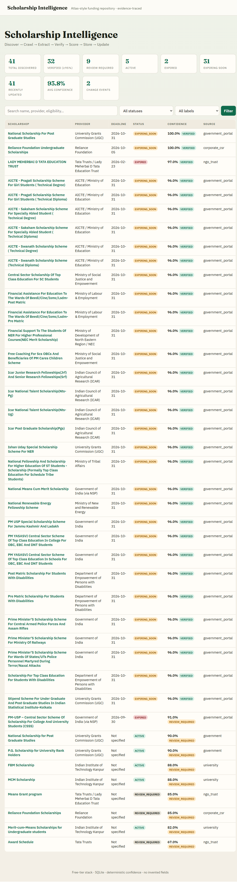

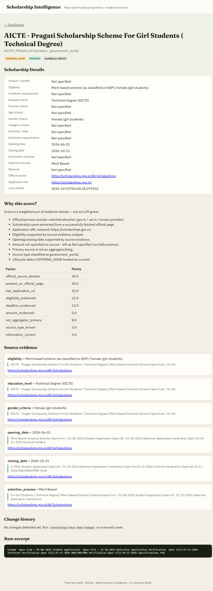

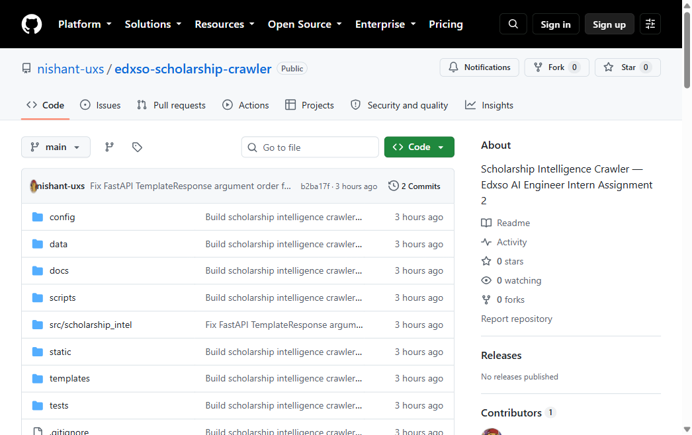

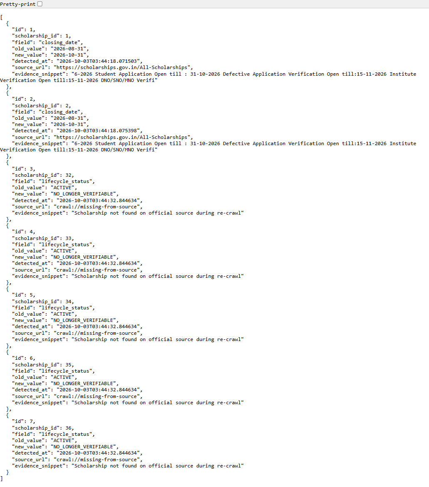

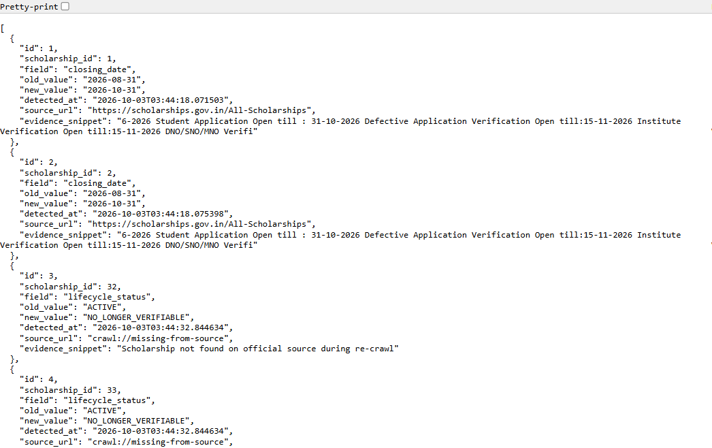

### Live sample run metrics

From a real crawl of official sources:

| Metric | Value |
|--------|-------|
| Total discovered | **41** |
| Verified against primary/official sources | **32** |
| Confidence ≥ 95% | **32** |
| Source types (≥3) | **5** — government_portal, government, university, corporate_csr, ngo_trust |
| Change detection examples | **2** deadline diffs (`2026-08-31` → `2026-10-31`) |
| Expired / stale examples | **2 EXPIRED** (e.g. NSP CSSS closed + Lady Meherbai window closed) |
| Fields with amount / income evidence | **8 / 4** |
| Avg confidence | **93.8%** |

**Integrity:** no fabricated amounts, incomes, or deadlines. Thin official cards keep those fields as `Not specified`.

Open the static demo page locally after clone:

```bash
python scripts/build_demo_page.py
python -m http.server 8766
# visit http://127.0.0.1:8766/docs/demo/index.html
```

Or run the live dashboard:

```bash
copy data\scholarships.sample.db data\scholarships.db
python -m scholarship_intel.cli serve
# http://127.0.0.1:8765
```

## Architecture

### System overview

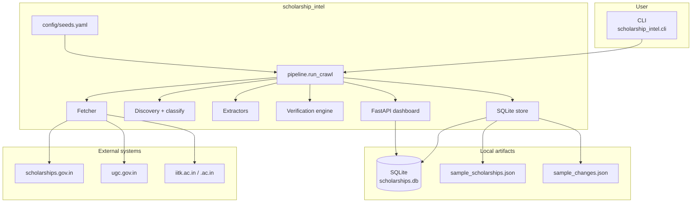

### End-to-end pipeline

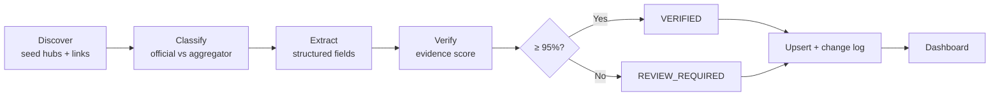

### Component map

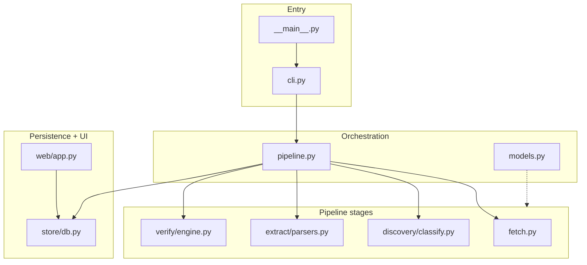

### Confidence decision flow

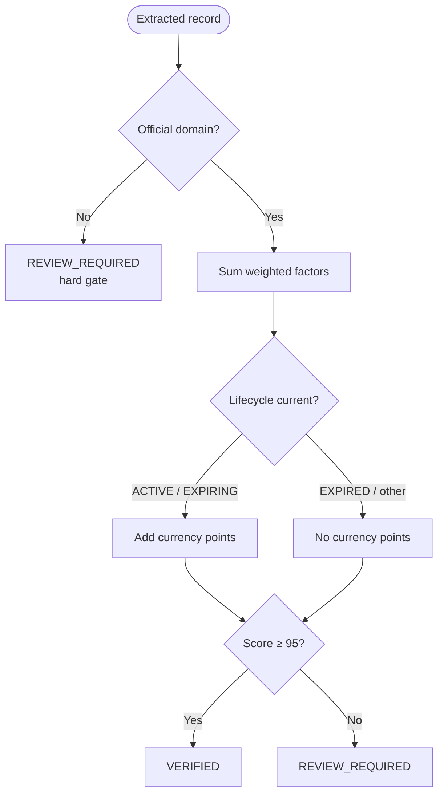

### Change + stale states

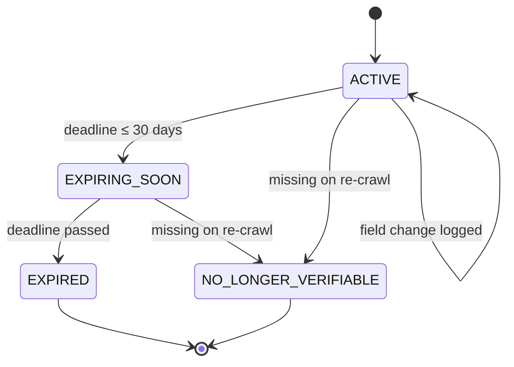

### Data flow

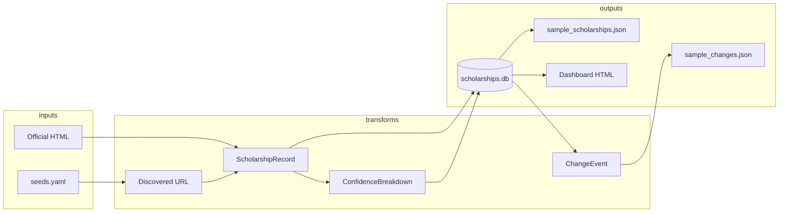

## Pipeline stages

| Stage | Module | Behavior |
|-------|--------|----------|
| Discover | `pipeline.py` + `config/seeds.yaml` | Seed hubs + in-page link discovery on official domains |
| Classify | `discovery/classify.py` | Official allowlist vs aggregator blocklist; source type |
| Crawl | `fetch.py` | Polite httpx fetch + local cached official PDFs |
| Extract | `extract/parsers.py` + `documents.py` | NSP cards, HTML detail pages, official PDF text |
| Enrich | `enrich.py` | Cross-fill evidenced fields across matching names (NSP↔UGC) |
| Verify | `verify/engine.py` | Deterministic weighted confidence (no LLM score) |
| Store | `store/db.py` | SQLite upsert + `change_events` history |
| UI | `web/app.py` | Searchable dashboard + detail evidence view |

## Quick start

```bash
python -m venv .venv
# Windows
.venv\Scripts\activate
# macOS/Linux
source .venv/bin/activate

pip install -r requirements.txt
# PowerShell
$env:PYTHONPATH = "src"

# Live crawl
python -m scholarship_intel.cli crawl --max-pages 22

# Reproduce change + stale demos
python scripts/finalize_demo.py

# Dashboard
python -m scholarship_intel.cli serve --port 8765
```

Artifacts:

- `data/scholarships.db` — working database  
- `data/scholarships.sample.db` — committed sample from a real crawl  
- `data/sample_scholarships.json` — export of records  
- `data/sample_changes.json` — change detection export  
- `docs/demo/index.html` — static demo summary  

## Configuration

See [`config/seeds.yaml`](config/seeds.yaml):

| Key | Role |
|-----|------|
| `seeds` | Official hub / detail URLs to start discovery |
| `official_domain_suffixes` | Domains allowed as primary sources |
| `aggregator_domains` | Never treated as authoritative |

## Design notes (quality & scale)

- **Typed domain models** (`pydantic`) with `FieldValue` + `Evidence` for traceability.
- **Discovery ≠ one scraper per URL** — seeds + link following + classification.
- **Anti-hallucination by construction** — extractors never invent income/amount/deadlines.
- **Idempotent re-crawls** — slug upsert + field-level change log.
- **CLI** with Typer for crawl / stats / demo-changes / serve.

## Tests

```bash
pytest -q
```

## Project layout

```
src/scholarship_intel/
  discovery/       # Source classification
  extract/         # NSP + detail parsers
  verify/          # Confidence engine
  store/           # SQLite + change history
  web/             # FastAPI dashboard
  pipeline.py      # Orchestration
  cli.py
config/seeds.yaml
templates/ + static/
docs/TECHNICAL_NOTE.md
docs/screenshots/
docs/demo/
data/
```

## APIs & tools used

| Tool / API | Required? | Role |
|------------|-----------|------|
| [httpx](https://www.python-httpx.org/) | Yes | Official page fetch |
| [BeautifulSoup](https://www.crummy.com/software/BeautifulSoup/) + lxml | Yes | HTML parse / extract |
| [pydantic](https://docs.pydantic.dev/) | Yes | Typed scholarship + evidence models |
| [Typer](https://typer.tiangolo.com/) + [Rich](https://rich.readthedocs.io/) | Yes | CLI |
| SQLite (stdlib) | Yes | Repository + change log |
| [FastAPI](https://fastapi.tiangolo.com/) + Jinja2 | Yes | Dashboard UI |
| [PyYAML](https://pyyaml.org/) | Yes | Seeds / allowlist config |
| [pypdf](https://pypi.org/project/pypdf/) | Yes | Official PDF text extraction (Reliance / Tata Trusts) |
| pytest | Dev | Unit tests (`tests/`) |

**No paid APIs / scrape services.** Free & open-source stack only.

## Assignment mapping

1. **Working crawler** — repeatable `crawl` over official Indian scholarship sources.  
2. **Authentic information** — official primary URL, application URL, source type, last verified, evidence.  
3. **Structured extraction** — name, provider, amount, eligibility, dates, category/gender/domicile when present.  
4. **Verification engine** — evidence-based confidence; ≥95% ⇒ `VERIFIED`.  
5. **Anti-hallucination** — `Not specified` when source is silent.  
6. **Auto crawler + change detection** — second run logs old/new values.  
7. **Stale / expired** — `EXPIRED`, `EXPIRING_SOON`, `NO_LONGER_VERIFIABLE`.  
8. **Database + UI** — SQLite + searchable dashboard with detail / evidence / history.  
9. **Minimum output** — 36 real / 31 verified / 3 source types / change + stale examples.  

## License

MIT — educational assignment submission. Respect site ToS and crawl politely.
